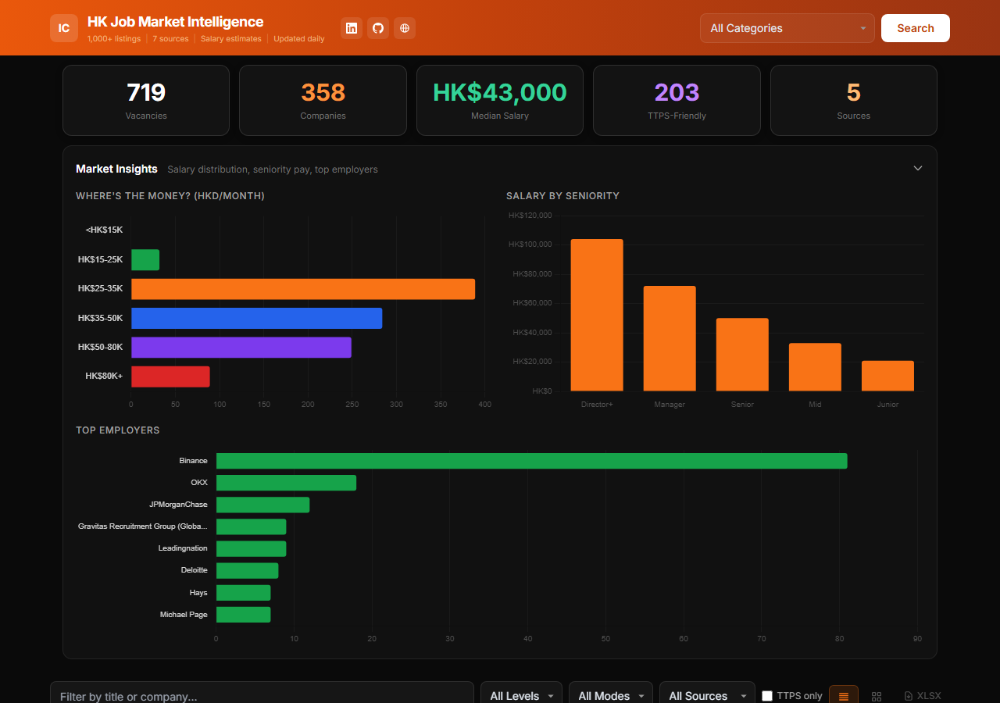
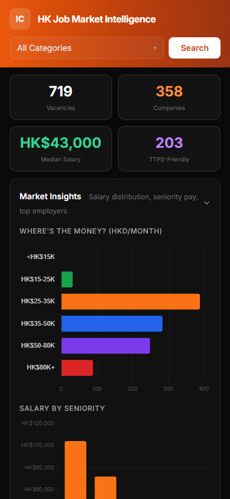

# HK Job Market Intelligence

Real-time Hong Kong job market dashboard aggregating 1,000+ listings from 7 sources with salary estimation, skill matching, and market analytics.

**Live:** [climbthesearches.com/hk-jobs](https://climbthesearches.com/hk-jobs/)



<details>
<summary>Mobile view</summary>



</details>

## Architecture

```
Job Boards (7 sources)          Analysis Layer              Frontend
========================        ==================          ==================
LinkedIn  ─┐                    Pydantic models             Astro.js + Tailwind
Indeed    ─┤ JobSpy             3-layer dedup               Chart.js analytics
Google    ─┘                    Skill matching (0-100)      Table + Card views
JobsDB ──── GraphQL API    ──►  Salary estimation      ──►  Sticky filters
Binance ─┐                      TTPS detection              Tax calculator
Animoca ─┤ Lever API            Seniority detection         Excel export
OKX ─────┐                      Category relevance
Agoda ───┤ Greenhouse API
         └──────────────────────────────────────────────────────────────────►
                                                            JSON ──► Astro ──► FTP
                                                            GitHub Actions (daily)
```

## Features

- **7 data sources** — LinkedIn, Indeed, Google Jobs (via JobSpy), JobsDB (reverse-engineered GraphQL), Lever API, Greenhouse API
- **Salary estimation engine** — Multi-signal model calibrated from [JobsDB](https://hk.jobsdb.com/career-advice/role/data-analyst/salary), [FastLane HR](https://fastlanehr.hk/average-salary-in-hong-kong/), and [Robert Half](https://www.roberthalf.com/hk/en/insights/salary-guide) March 2026 data. Uses seniority, company tier, role type, TTPS status, and premium skill keywords.
- **Skill matching** — Each job scored 0-100% against a configurable skill profile (Power BI, SQL, Python, fraud, SEO)
- **TTPS-Friendly detection** — Flags 60+ known international-hiring companies and visa sponsorship signals
- **Category relevance** — 12 targeted categories with title-based relevance scoring so each category shows distinct results
- **3-layer deduplication** — URL canonicalization + exact title/company + fuzzy matching (70% threshold)
- **HK tax calculator** — 2025/26 IRD rates with MPF, progressive bands, and standard rate comparison
- **134 unit tests** — Model validation, dedup logic, scoring algorithms

## Tech Stack

| Layer | Technology |
|-------|-----------|
| Scrapers | Python 3.11, httpx (async), python-jobspy |
| Data models | Pydantic v2 with field validators |
| Analysis | Custom scoring, salary estimation, regex-based detection |
| Frontend | Astro 5, Tailwind CSS 3, Chart.js |
| Testing | pytest (134 tests) |
| Deployment | GitHub Actions, Hostinger FTP |

## Quick Start

```bash
# Install dependencies
pip install -r requirements.txt
cd frontend && npm install && cd ..

# Scrape all 12 categories (takes ~15 min)
python generate_data.py --force

# Single category test
python generate_data.py --query "data analyst" --location "Hong Kong" --force

# Run tests
python -m pytest tests/ -v

# Frontend dev server
cd frontend && npm run dev    # http://localhost:4321/hk-jobs/

# Production build + deploy
cd frontend && npm run build && cd ..
python deploy.py
```

## Data Sources

| Source | Method | Jobs | Auth |
|--------|--------|------|------|
| LinkedIn | JobSpy wrapper | ~75/query | None |
| Indeed HK | JobSpy wrapper | ~25/query | None |
| Google Jobs | JobSpy wrapper | varies | None |
| JobsDB | Reverse-engineered GraphQL | ~250/batch | None |
| Binance, Animoca | Lever API | 138 HK | None |
| OKX, Agoda | Greenhouse API | 131 HK | None |

## Salary Estimation

HK employers rarely publish salary. The estimation engine uses 5 signals:

1. **Seniority** (Junior: HK$18K → Director+: HK$95K) — calibrated from JobsDB percentiles
2. **Company tier** — FAANG/banks +25%, crypto exchanges +15%, Big4 +15%
3. **Role category** — AI/ML +20%, Data Engineer +15%, SEO -15%
4. **TTPS status** — International-hiring companies +5%
5. **Premium skills** — ML, blockchain, quantitative: up to +15%

Confidence: High (3+ signals), Medium (1-2), Low (baseline only).

## Project Structure

```
hk-job-scraper/
├── scrapers/           # 4 async scrapers (JobSpy, JobsDB, Lever, Greenhouse)
├── models/             # Pydantic JobListing model with validators
├── utils/              # Shared analysis (skills, salary, mandarin detection)
├── tests/              # 134 pytest tests (models, dedup, scoring)
├── frontend/           # Astro.js static site
│   └── src/components/ # Header, StatsGrid, FilterBar, JobTable, Insights, etc.
├── generate_data.py    # Main pipeline: scrape → analyze → JSON
├── merge.py            # 3-layer deduplication
├── hunter_enricher.py  # Hunter.io recruiter email enrichment
├── deploy.py           # FTP deployment to Hostinger
└── export_excel.py     # Excel report generation
```

## Author

**Irmin Corona** — Senior Data Analyst | 7 years at Microsoft & Stellantis | TTPS Visa Holder

- [LinkedIn](https://linkedin.com/in/irmin-corona)
- [GitHub](https://github.com/ircorona)
- [Portfolio](https://climbthesearches.com)
